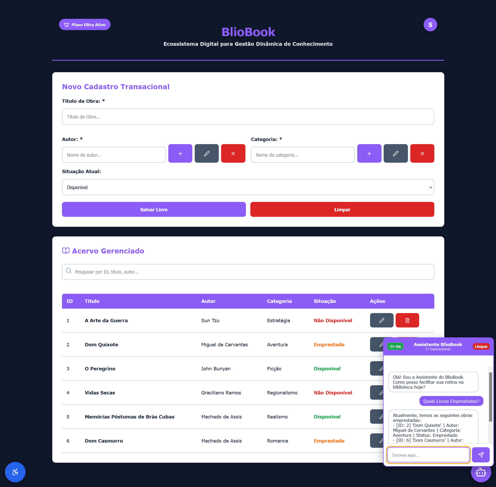

# BlioBook: Ecossistema Digital para Gestão Dinâmica de Conhecimento

🔗 **Acesso ao Dashboard em Produção:** [BlioBook no GitHub Pages](https://saulo7orres.github.io/bliobook/)

## Nossa Proposta

O BlioBook é uma plataforma reativa desenvolvida para solucionar a fragmentação informacional na gestão de acervos bibliográficos de pequeno porte e ONGs. O sistema une a fluidez de uma interface componentizada (CRUD completo com persistência local) ao poder de um agente de Inteligência Artificial local, permitindo buscas semânticas e interações dinâmicas sem dependência de infraestruturas externas de nuvem.

## 📸 Demonstração da Interface

Abaixo, ilustro a fluidez da nossa aplicação, focada na usabilidade para o mediador de leitura e na reatividade da listagem:



## Tecnologias Empregadas

* React + Vite
* Tailwind CSS
* Vanilla JS / React Hooks
* Python (FastAPI / Streamlit)
* Browser LocalStorage
* IA Local: LLM Gemma 3 (1B Parameters) via Llamafile

---

## 🧪 Engenharia de Qualidade e Automação (QA)

Este projeto implementa uma suíte de testes E2E (End-to-End) automatizada utilizando o framework **Playwright**, cobrindo 10 fluxos críticos do sistema através de uma arquitetura cross-browser (Chromium e Firefox).

### Justificativa Arquitetural: Padrão POM (Page Object Model)
A automação foi rigorosamente estruturada sob o padrão POM para garantir manutenibilidade e escalabilidade. A lógica de interação com o DOM foi abstraída nas classes `LoginPage` e `DashboardPage`, isolando-as dos scripts de asserção. 
* **Eliminação de Código Duplicado:** Mapeamentos de elementos são declarados uma única vez. Alterações de layout exigem manutenção em um único ponto da arquitetura.
* **Seletores Blindados:** Abandono de localizadores frágeis (como XPath absolutos ou gravadores). A interação é ancorada unicamente em atributos de acessibilidade e `data-testid` inseridos diretamente no código-fonte, garantindo testes resilientes a mudanças estilísticas.
* **Isolamento de Estado:** A suíte utiliza blocos `beforeEach` para injetar contextos limpos no LocalStorage via `addInitScript`, permitindo a validação da interface e regras de negócio de forma isolada, sem falsos positivos e sem uso de hard waits.

### Integração Contínua (CI/CD)
O ecossistema possui um pipeline configurado via **GitHub Actions**. A cada push na branch principal, o servidor orquestra um ambiente *headless*, executa a instalação limpa de dependências e roda a suíte de validação completa. O **Relatório HTML** consolidado é gerado e publicado automaticamente como um artefato do workflow, disponível para auditoria na aba Actions do repositório.

### Instruções para Execução e Validação Local dos Testes

1. No diretório raiz do front-end, instale as dependências base e os motores de navegação:
```bash
npm install
npx playwright install

```

2. Execute a suíte de testes completa (cross-browser e paralelizada):

```bash
npx playwright test

```

3. Para visualizar o relatório de execução analítico no navegador:

```bash
npx playwright show-report

```

---

## Como Executar o Projeto Localmente

O ecossistema do BlioBook é divisão em duas camadas: a interface cliente (Front-End) e a engine de inteligência artificial (Back-End). Siga os passos abaixo para rodar a aplicação completa.

### 1. Front-End (React + Vite)

Navegue até o diretório do front-end e execute os comandos para instalar as dependências e iniciar o servidor de desenvolvimento:

```bash
npm install
npm run dev

```

### 2. Back-End de Inteligência Artificial e Serviços Python

Certifique-se de que possui as dependências do Python instaladas antes de rodar as aplicações. No diretório do back-end, execute os seguintes módulos:

* **Para iniciar a API de IA (FastAPI / Uvicorn):**

```bash
python -m uvicorn api_ia:app --reload

```

* **Para iniciar a interface de monitoramento (Streamlit):**

```bash
python -m streamlit run app.py

```

---

## Configuração do Motor de Inteligência Artificial (LLM)

Para habilitar a mediação de leitura e as buscas semânticas do nosso assistente virtual, utilizamos o modelo Gemma processado 100% na máquina local. Isso garante privacidade absoluta e latência zero de rede.

### 1. Download do Modelo

Faça o download do executável através do link direto abaixo:
[Baixar google_gemma-3-1b-it-Q6_K.llamafile](https://www.google.com/search?q=https://huggingface.co/Mozilla/gemma-3-1b-it-llamafile/resolve/main/google_gemma-3-1b-it-Q6_K.llamafile%3Fdownload%3Dtrue)

### 2. Preparação e Execução do Servidor IA

Após o download, o arquivo precisa ser executado via terminal ou prompt de comando para instanciar a API local.

* **Para usuários Windows:**
Renomeie o arquivo baixado adicionando a extensão `.exe` ao final do nome (o resultado deve ser exato: `google_gemma-3-1b-it-Q6_K.llamafile.exe`). Em seguida, abra o terminal no diretório e execute:

```bash
.\google_gemma-3-1b-it-Q6_K.llamafile.exe

```

* **Para usuários Linux / macOS:**
Abra o seu terminal no diretório onde o arquivo foi baixado, conceda as permissões de execução e inicialize o binário:

```bash
chmod +x google_gemma-3-1b-it-Q6_K.llamafile
./google_gemma-3-1b-it-Q6_K.llamafile

```

Assim que o terminal do Llamafile estiver em execução, o ecossistema do BlioBook estará automaticamente integrado e pronto para responder às requisições do front-end.

---

## 👨‍💻 Autor

**Saulo Torres de Oliveira Assis**
